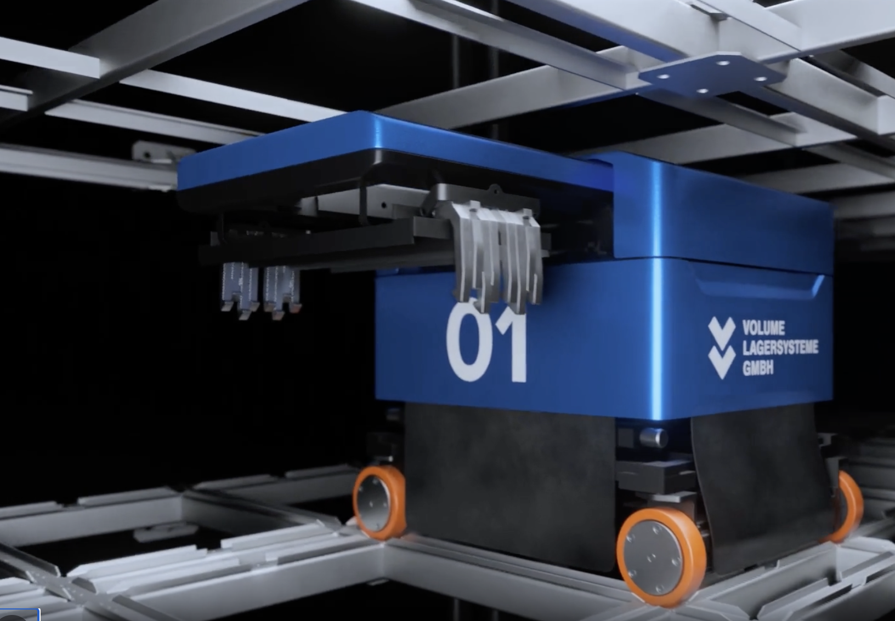
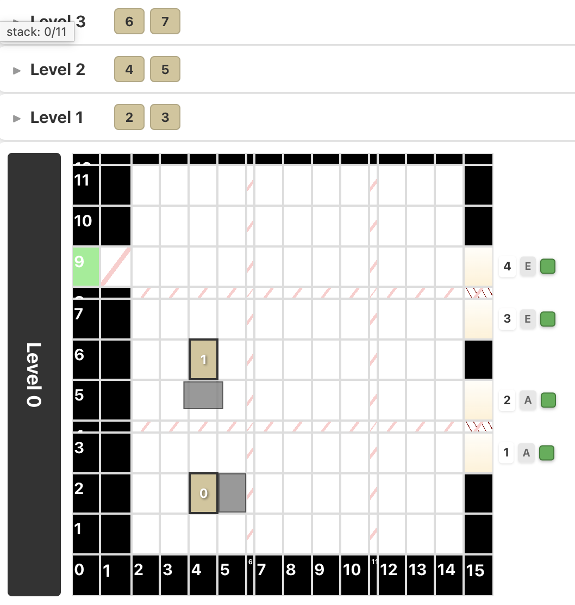

import { Image } from 'astro:assets';
import fixingTheRobot from '../../assets/fixing_the_robot.jpeg';
import multiAgentPathfindingGrid from '../../assets/multi-agent-pathfinding-grid.png';
import robotHandlingContainer from '../../assets/volume-dive-robot-handling-container.png';
import robotOnGrid from '../../assets/volume-dive-robot-on-grid.png';

**TL;DR:** Planning paths for actual robots in a warehouse cannot treat robots as points that move synchronously from one grid cell to another. Our approach takes into account both space and time, keeps track of the physical area covered by each action to avoid collisions.

## The warehouse and robots

Compact container-storage machine called [Volume DIVE](https://volume.eu/en/warehouse-automation-company/container-warehouse/) ([German product page](https://volume.eu/lagertechnik-hersteller/automatisches-behaelterlager/)). The storage rack is also the robots' road network.

<figure>

<Image
  src={robotOnGrid}
  width={600}
  alt="A Volume DIVE robot traveling across a dense rail grid above container towers"
/>

<figcaption><strong>The warehouse.</strong> Rails surround the container towers on every level.</figcaption>
</figure>

<figure>

<Image
  src={robotHandlingContainer}
  width={600}
  alt="A Volume DIVE robot viewed from above while reaching into a neighboring container tower"
/>

<figcaption><strong>Handling a container.</strong> The robot reaches sideways while its base stays on the rails.</figcaption>
</figure>

{/* <figure>

<figcaption><strong>The robot.</strong> A Snapper moving on the rail grid.</figcaption>
</figure>

<figure>

<figcaption><strong>The controller's map.</strong> The same warehouse represented as grid cells and robot footprints.</figcaption>
</figure> */}

Horizontal rails form a grid on each level. Standard plastic containers are stored in stacks between the rails. Small mobile robots—called **Snappers**—drive over the grid, take a container from a nearby stack, and carry it to another one or to a port where it can leave the storage system.

The robot (often called `agent` in reserach papers):
* can move forward and backward
* steer, to change between the two rail directions
* the tower on the robot contains a universal gripper and can rotate through 360 degrees, allowing the robot to take or place a container on any of its four sides.
* The gripper can extend beyond the robot body

The grid:
* steel grid, holds both robots and boxes
* orginzed in multiple levels, so that robots on each level can operate independently
* steel columns supporting higher levels become obstacles for robots
* multiple robots operate simultaniously on the same level

To optimize system perforamnce, e.g., number of boxed moved per hour, robots should travel fast. Finding the shortest route for one robot is straightforward. Coordinating many robots on the same compact grid—while some are moving, waiting, carrying containers, or failing—is not.

## The multi-robot route planning problem

<figure>

<Image
  src={multiAgentPathfindingGrid}
  width={600}
  alt="A multi-agent pathfinding example on a grid"
/>

<figcaption><strong>Handling a container.</strong> The robot reaches sideways while its base stays on the rails.</figcaption>
</figure>

Standard solution to multi-robot routing is [Multi-agent pathfinding (MAPF)](https://en.wikipedia.org/wiki/Multi-agent_pathfinding): There is a graph, each robot has a unique start and a unique goal, and the planner must find paths without vertex or edge collisions.

That is a useful model, but it omits most of what made pathfinding difficult in our warehouse.

| Clean MAPF model | Warehouse reality |
|---|---|
| Position is a graph vertex represenging position (x, y) | State includes cell, level, tower orientation, wheel direction, and gripper position |
| Goal positions are unique | Robots need to deliver multiple boxes to the same destination |
| A robot occupies one vertex | A robot's footprint is larger than one cell. Other robots cannot stand in neighboring cells |
| Every move takes one time step | Move, steer, rotate, and wait have different measured durations |
| All paths are planned together | Some trajectories cannot be changed. E.g., robot lifting a box cannot move |
| Reaching the goal completes the plan | The destination must remain usable while the robot performs its next operation |
| The plan is executed exactly | Hardware can lag, stop, disconnect, or report an unexpected state |

The multi-agent pathfinding problem statement is a good foundation, but the difficult part is how to adapt it to the real world.

## A state is more than a cell

Two robots at the same grid coordinate are not necessarily in equivalent states. One may have wheels aligned along the X axis and another along Y. Their next legal actions and action durations differ. Head orientation changes the footprint around obstacles and determines how the robot can approach a storage location.

Our pathfinding state therefore contains the grid position and warehouse level, but also o and wheel orientation. Gripper position matters too: ordinary path search only accepts a retracted gripper. Extending it is handled as a separate physical operation.

This makes the graph larger, but it avoids a worse alternative: producing a cell path that cannot be translated into safe robot commands. Steering and o rotation are edges in the graph even when they leave the robot in the same cell, because both consume time and physical space.

## Collision checking uses actual sweeping areas

Cell-level collision rules were not enough. A robot body can extend outside its current cell, and a movement sweeps every position between its start and finish. Columns, narrow cells, ports, and prohibited areas also have physical geometry that does not fit a simple “one robot per cell” rule.

For every possible action, the planner calculates rectangles covering the swept robot footprint. A reservation combines those rectangles with a time interval. Space-time A* rejects an action when its reservation intersects a reservation belonging to another robot.

This representation gives us one collision language for several cases:

- A moving robot crossing another robot’s trajectory.
- A rotating robot clipping a column or another robot.
- A stationary robot blocking an aisle.
- A robot occupying a destination after arrival.
- Extra clearance required near ports and other special areas.

## Time is part of the map

Our route searching does algorightm not visit only a robot state. It visits a `(state, time)` pair. Action duration comes from configured physical timings and, for movement, the actual cell sizes in millimetres.

Simple function estimating distance called 'heuristic', which are essential for A* pathfinding, stop working. The time dimension makes A* explore too many nodes, rendering it useless. It turns out, by encoding state into smallest amount of bits possibly and using some other tricks, the perfect state-to-state time can be precomputed using Dijkstra.

Waiting is an action rather than an error. A robot may have a clear geometric route but need to pause until another robot releases an intersection. At the goal, the planner also checks that the robot can remain there for a requested time. Otherwise it could return a route that technically reaches a port but conflicts with another robot during the box operation immediately afterwards.

## We did not solve every robot jointly

Jointly optimizing every robot path is attractive on paper and expensive in practice. Our controller already has committed actions, ongoing tasks, immobile robots, and new work arriving continuously. Recomputing one globally optimal plan would create a large search problem and make a small change disturb unrelated work.

We use prioritized planning instead:

1. Keep reservations for actions that are already committed.
2. Plan a path for one robot around those reservations.
3. Reserve the new path.
4. Plan the next robot around everything reserved so far.

The tradeoff is straightforward. This approach is fast, incremental, and easy to inspect, but it is incomplete: an unlucky planning order can block a solution that another order would find.

We handle that failure directly. When several robots must move away, the controller tries different deterministic robot orders. If planning fails for a prefix of an order, that prefix is remembered and skipped on the next attempt. This is much smaller than a general optimal MAPF solver, while addressing the ordering failures we actually encounter.

It does not guarantee the best plan. It gives us a bounded search with useful failure messages and reproducible tests. For an operational controller, those properties matter.

## Safety margins can become traffic jams

Our first safe reservation for a straight move covered the full swept rectangle for the entire action. That is conservative, but it blocks space the robot has already left. In a dense warehouse, many individually reasonable margins combine into unnecessary traffic.

We now split a move into two reservation phases. During the first phase, the reservation covers the start and destination side of the movement. During the second, it releases the cleared part and keeps the remaining area reserved. The midpoint is calculated from travelled millimetres rather than half the number of cells, because cells can have different physical sizes. A small timing tolerance delays the release.

**But it is not free** If the controller releases the first part of the path, it must verify that the real robot has progressed far enough. Otherwise **BANG!**.

## Unpredictable humans is a real issue

When box is delivered to a port, an operator needs to put or take some ites to or from the box. The port is being occupied for unknown amount time. This rises multiple questions
- When should robot come to store the box back to the grid?
- Should robot wait at port until the box is ready to be stored?
- Should other robots start digging for next boxes to move them closer to port?

There are no obvious answers to them. Make simulations, add configuration toggles, and try what works best in production.

## Things go wrong
<figure>

<Image
  src={fixingTheRobot}
  width={720}
  alt="A mechanic fixing a broken robot"
/>

</figure>

One would guess that the biggest problem is optimizing the task sequence, applying Machine Learning, transforemers, AI, ... But, actually, most of the code deals with errors of varying nature. Especially, when dealing with developement version and prototypes.
* Wires brake, motors overheat, batteries die, people leave nuts & bolts on the rails,...
* Tilted stacks because boxes cannot fit into each other
* Operator puts or scans wrong box. Robot should check what he is holding.
* Robots can stop between expected positions. Special *recovery* commands are needed to safely reach correct cell.
* Communication can disappear. We need to track it, re-try the connection if possible.
* Robot can ignore the command
* A robot can take longer than its reservation. 
* An unregistered test robot can appear on the grid
* The steering clutch got loose
* Belts got longer over time
* Broken box
* Someone pressed an emergency button
* many others...

The first idea was 'Just stop the warehouse and let the operator fix the problem manually'. Nope, doesn't work. Development versions of the robots break ALL THE TIME. And then first production versions work for 'some time'. The warehouse still needs to keep going. Strategies we had to use:
1. Try to *auto-recover* robot: lift the gripper back to top position, move robot to proper cell from *in-between* position, steer the de-calibrated wheels, ...
2. Block time and space around the robot to avoid collisions with other working robots
3. Evacuate robot to service station
4. Block the whole level
5. And last resot - stop the whole warehouse and call for help

## Conclusion

Research papers on MAPF is a great starting point. A papier may look nice and the algorithm can hold top position on benchmarks, but actually using it is a whole lot more.
